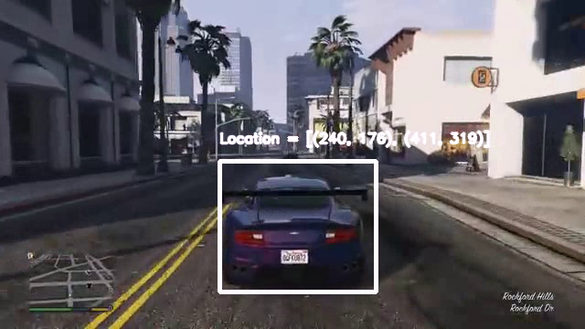

# object-tracker



_Real-Time Object Tracker written in Python using dlib and OpenCV_ | [Video 1](https://www.youtube.com/watch?v=uLZquACzXVg) [Video 2](https://youtu.be/VVo-5kVmDEY)

---

## Quick Links

* [Dependencies](#dependencies)
* [Starting the code](#starting-the-code)
* [How to perform tracking](#how-to-perform-tracking)

## Dependencies

* [`Dlib` with Python support](http://dlib.net/)
* [`OpenCV` with Python support](http://opencv.org)

## Starting the code

Tracking can either be done using a live video from a webcam or using a video file.

### Tracking using Video File

To run the code using a video file use the following command line argument --

```shell
python object-tracker-single.py -v <path-2-video-file>
```

For example, you can use the demo video provided with this code as --

```shell
python object-tracker-single.py -v demo-video-single.avi
```

### Tracking using Live Video

To run the code using live video use the following command line argument --

```shell
python object-tracker-single.py -d <device-id>
```

For example, on most systems device id 0 is the webcam attached.

```shell:
python object-tracker-single.py -v docs/demo-single-video.avi
```

Use the `-l` or `--dispLoc' command line option to display the locations of the tracked object as show below - 


```shell:
python object-tracker-single.py -v docs/demo-single-video.avi -l
```

__NOTE__ -- If you want to do multi object tracking code, use the file `object-tracker-multi.py` instead of `object-tracker-single.py`. This is a hack to do multi-object tracking and __hence the code slows down__.

## How to perform tracking

Once the code starts, it will start the video file or the live stream. To select the objects to be tracked, pause the video by pressing the <kbd>p</kbd> key.The next step is to create a bounding box around the object(s) to be tracked. Press the mouse to select the top-left pixel location of the object to be tracked and then release the mouse on the bottom-right location of the object to be tracked. Once, this is done press <kbd>p</kbd> to start the tracking. Also, if you want to discard the object, press the <kbd>d</kbd> key. In SINGLE OBJECT TRACKING MODE, you can only select one object but in MULTI OBJECT TRACKING MODE, you can select as many objects you want but at the cost of speed. Press <kbd>esc</kbd> anytime to gracefully quit the code.
